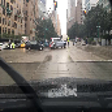

<a href="https://colab.research.google.com/github/hpatel530/Capstone/blob/main/readme.ipynb" target="_parent"></a>

# **Image Classification For Autonomous Vehicles**

---


## Creating A Multi-Label Image Classification Model For Autonomous Vehicles 


---


### **Author:** Hiten Patel 

The contents of this repository detail an analysis of my capstone project. This analysis is detailed in hopes of making the work accessible and replicable.

**Blog Post:** https://hpatel530.github.io/blog_number_7_by_hiten_patel


## **Abstract**

---

On average, there are 6 million car accidents in the U.S. every year. That's roughly 16,438 car accidents per day. Of those 6 million car accidents, over 3 million people experience a non-fatal injury and over 37,000 Americans experience death. Over 100 people die per day due to car accidents in any given year. A 2016 study by the National Highway Transportation Safety Administration (NHTSA) found that human error accounts for 96% of all auto accidents.

A self driving car, also known as an autonomous vehicle, is a vehicle that is capable of sensing it's environment and moving safely with no human input. An autonomous vehicle needs sensory input devices like cameras, radars,  and lidars to allow the car to perceive the world around it, creating a digital map. Object detection is a two-part process, image classification and then image localization. Our focus will be image classification, which is determining what the objects in a image are. Is it a car, traffic light, a person or all of the above?

To explore this question, we built a convolutional neural network using the Berkely DeepDrive dataset to create a multi-label model which contains 70,000 training images and 10,000 validation images. 

This multi-label CNN model was responsible in predicting up to 12 labels in any given image. The dataset possesses geographic, environmental and weather diversity which is useful for training models that are less likely to be surprised by new conditions. Image classification labels consist of ['lane', 'drivable area', 'truck', 'motor', 'person', 'rider', 'bike', 'train', 'car', 'traffic light', 'bus', 'traffic sign']. Instead of using accuracy as our primary indicator on how well a model performs, we used Hamming Loss. The Hamming Loss function takes the number of incorrect labels predicted and divides it by the total number of labels. The lower the number (closer to 0), the better the model performed. The final cnn model produced a hamming score of 11%, which can be interpretated as 89% percent correctly predicted labels.

## **Business Problem**


---

Can we create a multi-label image classification model to help create autonomous vehicles to mitigate car accidents?

## **Data**


---

The data used in this project was obtained by:


*   [Berkley Deep Drive ](https://bdd-data.berkeley.edu/)
  * Click on download

The dataset contains over 100,000 images and 100,000 videos. For this project, we used the images only. The dataset possesses geographic, environmental and weather diversity which is useful for training models. 

>**Citations:**
@InProceedings{bdd100k,
    author = {Yu, Fisher and Chen, Haofeng and Wang, Xin and Xian, Wenqi and Chen,
              Yingying and Liu, Fangchen and Madhavan, Vashisht and Darrell, Trevor},
    title = {BDD100K: A Diverse Driving Dataset for Heterogeneous Multitask Learning},
    booktitle = {The IEEE Conference on Computer Vision and Pattern Recognition (CVPR)},
    month = {June},
    year = {2020}
}


## **Methods**

---

The project was organized based on the OSEMN framework; Obtain-Scrub-Explore-Model-iNtrepretation; we will go through a brief overview of each step. 


### **Scrub**


---


The dataset contained an image folder which contained only images and a labels folder which contained the labels to go with the images. The labels covered each image in detail from category, attributes, location, and weather. For the purpose for this project, we only wanted 'category' which we extracted and ended up with 12 unique labels. 

In order to be used in a machine learning algorithm known as a convolutional neural network, we then needed to process each image through the ImageDataGenerator to rescale and resize. 

### **Explore**


---


After we extracted our 12 unique labels, we took a look at how many times each label appeared. This is a multi-label classification problem so each image can have more than one label.As we can see below, the following labels had;

a very low frequency: 
> ['train', 'motor', 'rider', 'bike', 'bus'] 

a medium frequency:
>['truck', 'person', 'traffic light']

and a high frequency: 
>['traffic sign', 'lane', 'drivable area', 'car']


Once again, this is a multi-label image classification problem so let's take a look at what the label counts are per image. 


As we can see above in the chart, 17,393 images had 4 labels. That was the most with 14,008 images had six labels coming in second. There were 13 images that had 11 labels and 0 images contained all 12 labels. 

### **Model**


---


#### **Basic Model**

Our first CNN model will keep the feature space wide and shallow in the initial stages of the network by using smaller kernel/filter sizes and a low number of channels. This neural network will have a input layer, hidden layer and then an output layer.  The activation function will be 'relu' and the final activation will be 'sigmoid' as it is a multilabel image classification network. We will use the optimizer 'Adam' as it generally bodes well for CNNs. 

The best metric to measure our model is the Hamming Loss. Remember, hamming loss measures the incorrect predictions divided by the total number of predictions. For this model, we received a hamming score of .1292 (depending on the run), which in turn gives an accuracy of .8708. The next metric to measure our model is given by the accuracy on the test validation set which was approximately .2285 (depending on the run). The Val loss is .3288 and is greater than the loss at .2188, this could be signs of overfitting. In the first graph below, it illustrates the possibility of this model overfitting, we want the end points to be closer together. The second graph shows the similarites in accuracy which we also want the final points to end closely together as well. 


#### **Tuned CNN Model**

For our final tuned CNN model, we tried something a little diffrent. Our past models followed a Conv2D-Pool pattern for all it's layers and this time around we will implement a Conv2d-Conv2d-Pool pattern. After a grid search to retreive the best metrics, we inputted the following hyperparameters; 

* padding = 'valid'
* dropout = '.5'
* optimizer = 'adam' 

Along with these hyperparameters, we also implemented an early stopping protocol to prevent overfitting. 


```python
def make_cnn(padding='same', dropout =.2, optimizer=keras.optimizers.Adam(lr=0.001)):
    """
    Creating a neural network function

    Parameters:
    ----------
        padding: 'same' or 'valid'
        dropout: between 0 and 1
        optimizer: keras optimizer 

    Returns:
    -------
        model summary
        model (construction of model)
    """

    #fix random seed for reproducibility
    np.random.seed(123)

    #instantiate model 
    model = Sequential()

    #input layer 
    model.add(layers.Conv2D(32,(3, 3), activation='relu',padding=padding,
              input_shape=(train_images.shape[1],train_images.shape[2],3)))
    model.add(layers.Conv2D(32, (3, 3), activation='relu',padding=padding))
    model.add(layers.MaxPooling2D((2, 2)))
    model.add(layers.Dropout(dropout))

    #first hidden layer
    model.add(layers.Conv2D(64, (3, 3), activation='relu'))
    model.add(layers.Conv2D(64, (3, 3), activation='relu'))
    model.add(layers.MaxPooling2D((2, 2)))
    model.add(layers.Dropout(dropout))

    #second hidden layer 
    model.add(layers.Conv2D(128, (3, 3), activation='relu'))
    model.add(layers.Conv2D(128, (3, 3), activation='relu'))
    model.add(layers.MaxPooling2D((2, 2)))
    model.add(layers.Dropout(dropout))

    #output layer  
    model.add(layers.Flatten())
    model.add(layers.Dense(128, activation='relu'))
    model.add(layers.Dense(64, activation='relu'))
    model.add(layers.Dropout(dropout))
    model.add(layers.Dense(12, activation='sigmoid'))

    #compile model 
    model.compile(loss='binary_crossentropy',
                  optimizer=optimizer,
                  metrics=['acc'])

    #summary
    model.summary()
    return model 

```

The final tuned CNN model stopped at epoch 9 (depending on the run) to prevent over fitting. Once again, we will use the Hamming Score to measure the model which was .1172. A score closest to zero is what we cant and this was the best score thus far. This equals out to an accuracy of 89% (1-hamming score). The next metric to measure our model is given by the accuracy on the test validation set: approximately .006 (depending on the run). This is an extremely low score and may be a metric we choose to ignore. The loss for validation set (around .2645) is roughly the same as the loss for the train set (around .2698), signs of not overfitting. We can also take a look at the confusion matrix for the 12 labels. 


#### **Pretrained Model** 

InceptionResNetV2

For this pretrained model, we used an InceptionResNetV2 model and set the input and output parameters to meet our requirements. The base of this pretrained model is what we have added to make this tranfer learning successful. Although the model stopped at epoch 5 (depending on the run) to prevent overfitting, it has a very long training time. The hamming loss metric for this model was .1434(depending on the run) which in turn gives an accuracy of .8566. The next metric to measure our model is given by the accuracy on the test validation set which was approximately .9351(depending on the run). Wow!!! This is very interesting. All our models produced a very low accuracy score and this one was very high. The hamming score was higher of all the models.  The loss for validation set (around .271) is nearly equal to the loss for the train set (around .275), this shows no signs of overfitting. 


>**Based on the results from our models, our tuned CNN model slightly outperformed our pretrained InceptionResNetV2 model. Both models returned a Hamming Loss Score of roughly 11-13% (depending on the run), both models showed no signs of overfitting.  CNN model had a test accuracy of roughly .006% (which was the lowest out of all the runs, usually around 10%) compared to the pretrained model returning a test accuracy score of roughly 93%. This was also an anomaly, usually we received around 10%. The metrics are interesting here, let's give each model a test run**

### **Intrepretations**


---


**Test 1**


**CNN Model**


**Pretrained Model**


>**Observations:**
* The final model did not predict 'truck' and incorrectly predicted 'traffic light'. The model got 10/12 labels correct. 
* The inception model did not predict 'truck'. The model got 11/12 labels correct.

**Test 2**



**CNN Model**


**Pretrained Model**


>**Observations:**
* The final model did not predict 'bus', 'truck', 'motor' or 'person'. 8 of 12 labels predicted correctly. 
* The inception model did not predict 'bus', 'truck', 'motor', 'traffic light' or 'person' leaving the model being correct on 7/12 labels. 
* Both models did not predict the same labels except 'traffic light'. This could be because those same labels are on the lower side of occurrences in the training set. The pretrained model could be confusing 'traffic light' and 'traffic sign'. 

## **Results**


---

* The final model followed a Conv2D-Conv2D-Pool pattern with four layers. Input layer, hidden layer 1, hidden layer 2 and output layer. 

* Image Sizes were set at 86 x 86, this was the largest we could set the images at without my computer crashing.

* The final model produced a hamming score of 11% which equals to a 89% accuracy rate. Remember, the hamming score loss function takes the number of wrongly predicted labels divided by total number of labels.

* The InceptionResNetV2 model produced a hamming score of 14% which equals to 86% accuracy. 

* The training set had over 17,000 images that contained 4 different labels, which was the most. 

* The training set had 13 images that contained 11 labels, no images had all 12 labels at once. 

* The labels with the least occurrence(labels 0-5) in the training set, the final model and pretrained model had a hard time predicting. 

* The labels with the most occurrence (labels 6-11) in the training set, both models was able to predict most of the time except for 'traffic light' for the pretrained model. It seemed to miss this one most of the time. 


## **Recommendations**

---

**Based on the analysis, we can offer the following recommendations:**

1. Since this model is not predicting all objects correctly, car companies can use this model as a driver assistant to help alert the driver of what is seen on the road. Essentially a second pair of eyes which would be great when driving in either the dark, day or rush hour. This will help mitigate the occurrence of car accidents. 

2. This model can be used as a starting point for companies that are creating a self driving electric car. 

3. If you are building your own multi-label image classification model; I recommend the following; 
  * Use a convolutional neural network.
  * A dataset that possesses geographic, environmental, and weather diversity, which is useful for training models that are less likely to be surprised by new conditions.

## **Limitations & Next Steps**

---

To improve our project, the following steps have been outlined

1. Data augmentation for labels that occured the least. This will improve the model and help classify objects that are rarely seen.

2. Increase image size. The larger the image (while keeping its sharpness) will improve the model performance.

3. Adding object localization. In this project, we completed object detection (image classification) which is to classify and detect all objects in a image.  The next step is object localization which is locating where that object is and drawing a bounding box. 

4. Explore other frameworks such as MEKA, LSTM and YOLO that can be used for multi-label classification problems 

## **For Further Information**

---

Please review the analysis in google colab notebook or the powerpoint presentation which is in pdf. 

For any additional questions, you can email me at h.patel.ms@gmail.com or connect with me on [Linkedln ](https://www.linkedin.com/in/hitenpatel3/)
